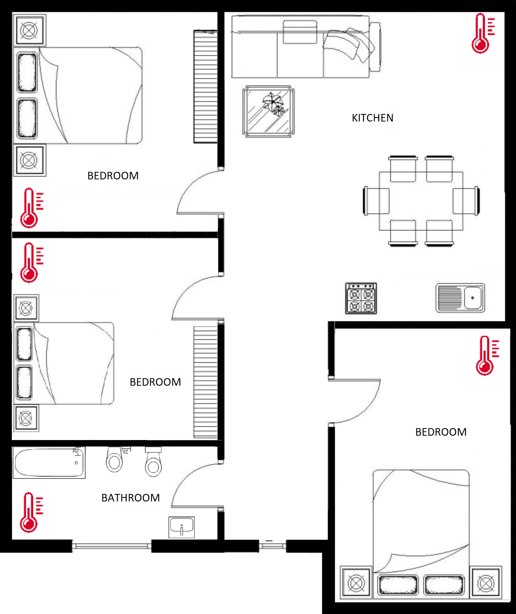

# House temperature monitoring system & smart air distribution

## Project for the Mobile and Cyber-Physical Systems course @ University of Pisa

## Description
The project aim to develop a system to monitor the temperature of the rooms inside the house. This is obtained by sensors that collects data and send them using *MQTT*. The server reads the data and store it in a local database in order to be accessed by the main application.
The application offers three different features:
 - Through a user interface monitor the temperatures of all the rooms
 - Plot the trend of the temperature for a specific room and using AI predict its future behaviour
 - Activate the ventilation system to balance the temperature among the various rooms

<br>
<div align="center">
  
  <br>
  <em>Example of application interface</em>
</div>
<br><br>

## How to run
First, to start server and sensors just run the script
```bash
./start_sensor_server.sh
```
Then, to run the applications just run the python script.

Check `requirements.txt` for libraries required.
```python
# Show house interface with temperatures
python real_time_map.py

# Show the trends for a specific room
python real_time_plot.py <room>

# Activate the ventilation system
python ventilation.py <ventilation_force>
```